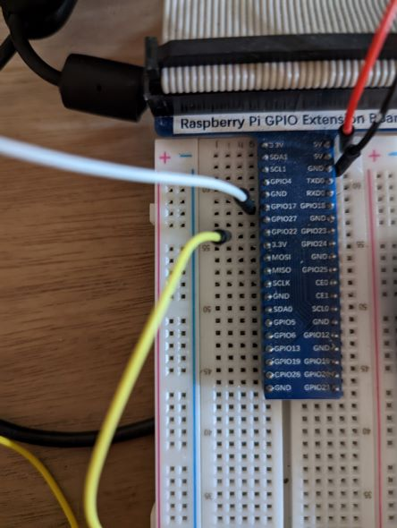
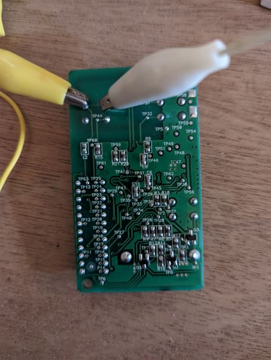
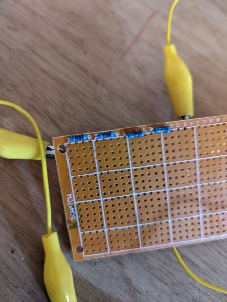
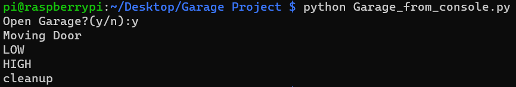

# Garage Door Opener/Closer Project

**Warning: This project is very customized and was developed purely for my own entertainment. This readme is not intended to be instructional, but rather to serve as a muse or starting point for someone wanting to complete similar projects.**

## Explaination of Files:

**Garage_main.py:** This is the "full" version of the script. It contains code for the GUI and is meant to be run from the raspian environment.

**Garage_from_console.py:** This file uses the console as a substitute for the GUI. This file allows for access and control of the opener/closer script remotely through ssh connection. Eliminating the GUI allows for the script to be run on a machine without Pygame installed.

**Garage_script.py:** This is a "bare minimum" script meant to open/close the garage door immediately upon running. There is no user interaction other than running the script.

**GPIO_status:** This is a useful file that was used in the debugging process. It simply returns a value of "HIGH" or "LOW" for pins 13, 15, and 17. This code can easily be modified to return the status of any pin. Pins 13 and 15 were used in this project for circuit control.

## Resources Used For Project:

[Rasberry Pi 4](https://www.raspberrypi.com/products/raspberry-pi-4-model-b/): Other models may work, but this code has not been tested on any other model.

(Recommended): [GPIO extension board](https://www.amazon.com/s?k=Qunqi+Extension+Board+for+Raspberry+Pi+B+Model+B+Plus&camp=1789&creative=9325&linkCode=xm2&linkId=14854675dbfd014e5c4281a912f69a93&tag=thebittetru0f-20&ref=as_li_qf_sp_sr_il_tl) and [Jumper Wires](https://www.amazon.com/REXQualis-120pcs-Breadboard-Arduino-Raspberry/dp/B072L1XMJR/ref=sxin_15_pa_sp_search_thematic_sspa?content-id=amzn1.sym.4e7a2229-074e-44de-95c4-9fd858f46295%3Aamzn1.sym.4e7a2229-074e-44de-95c4-9fd858f46295&cv_ct_cx=raspberry+pi+jumper+wires&keywords=raspberry+pi+jumper+wires&pd_rd_i=B072L1XMJR&pd_rd_r=0baba6e9-655f-468b-b8bc-996dffe6c81b&pd_rd_w=rrecs&pd_rd_wg=IhpjU&pf_rd_p=4e7a2229-074e-44de-95c4-9fd858f46295&pf_rd_r=J4VM4F2S27DBSSKHFGHE&qid=1670992571&sr=1-1-a73d1c8c-2fd2-4f19-aa41-2df022bcb241-spons&psc=1&spLa=ZW5jcnlwdGVkUXVhbGlmaWVyPUEyRFNZWE5LWUExU083JmVuY3J5cHRlZElkPUEwMTgzODI3VjZPRkdDTThBSzdKJmVuY3J5cHRlZEFkSWQ9QTA2NTYzMDQyNUtER0JJWVhRNldCJndpZGdldE5hbWU9c3Bfc2VhcmNoX3RoZW1hdGljJmFjdGlvbj1jbGlja1JlZGlyZWN0JmRvTm90TG9nQ2xpY2s9dHJ1ZQ==).

Pygame for python installed found [here](https://www.pygame.org/news). Instructions on Pygame site for installation.

Garage Door Remote. I used the [Chamberlain Klick1u](https://www.amazon.com/Clicker-KLIK1U-Universal-2-Button-Garage/dp/B0013Q0S4S/ref=asc_df_B0013Q0S4S?tag=bingshoppinga-20&linkCode=df0&hvadid=80126962060005&hvnetw=o&hvqmt=e&hvbmt=be&hvdev=c&hvlocint=&hvlocphy=&hvtargid=pla-4583726540707843&psc=1).

Resistors totalling 4KΩ. I used 4x [1KΩ resistors](https://www.amazon.com/EDGELEC-Resistor-Tolerance-Resistance-Optional/dp/B07HDDWFDD/ref=asc_df_B07HDDWFDD?tag=bingshoppinga-20&linkCode=df0&hvadid=80264404184492&hvnetw=o&hvqmt=e&hvbmt=be&hvdev=c&hvlocint=&hvlocphy=&hvtargid=pla-4583863982195219&th=1).

## Project Features:

### Python Code

**Interaction with GPIO pins**

The GPIO pins were switched beteen "high" and "low" status to control opener/closer circuit.

**Pygame library**

Pygame is intended for creating games, but it served as a handy resource for creating a simple GUI for running the script from the Raspbian environment.

**Listener loop with data validation**

A "while" loop structure was used to listen for a keypress event, as well as reject unwanted input.

### Simple Circuitry

**Circuit exploring**

The garage door remote circuitry was explored to locate the circuit used for transmiting opener code. The button was bypassed to allow for control via the script.

**Measuring and calculating**

The garage remote circuit current and potential were measured and recorded under normal operating conditions. No documentation on the circuit was found, so to be safe a calculation was made to determine the appropriate resistance required in the bypass circuit to match the measured current of the original cicuit configuration.

**Use of printed circuit board**

A PCB was used for housing the resistors and will be used for transistors as this project evolves.

### Remote Execution of Code

Windows PowerShell was used to connect to the Raspberry Pi via SSH protocol and execute the code from a remote machine.

## Plans for Future Developent:

- Add magnets to garage track with circuitry to return a value of "open" or "closed"
- Create website for executing code remotely
- Develop mobile app to be able to control garage from Android phone
- Solder all components when project is finished and fully tested
